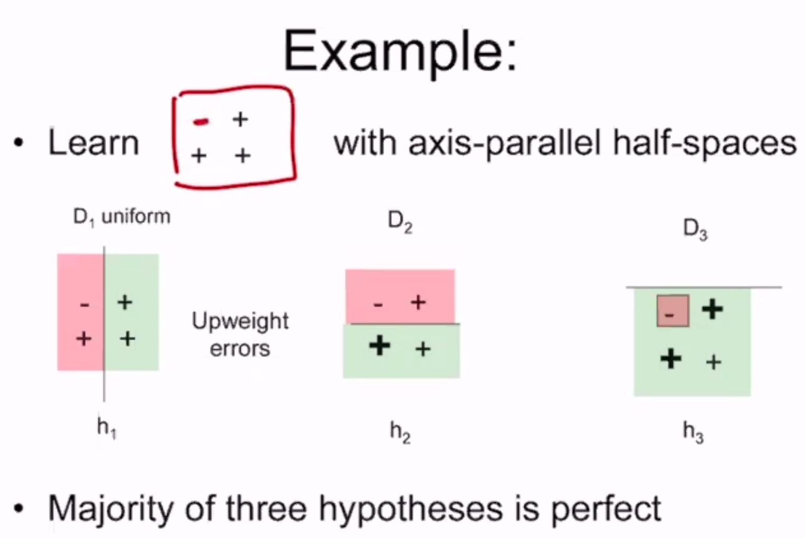
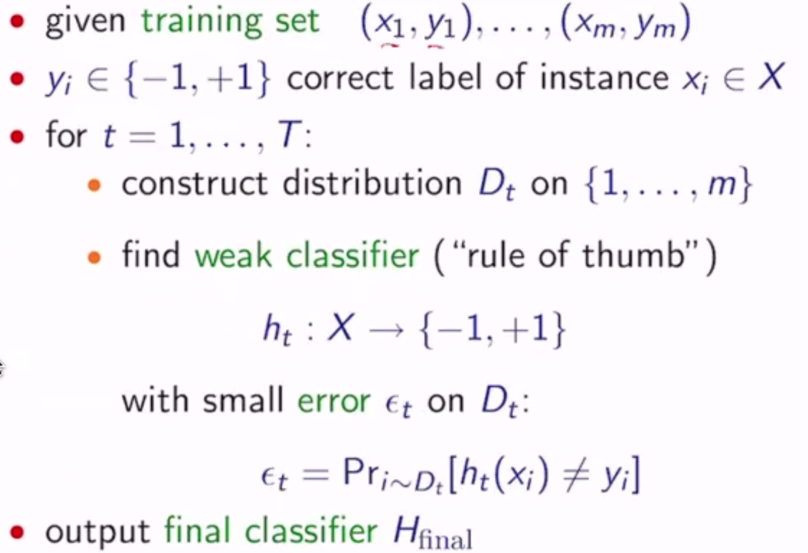
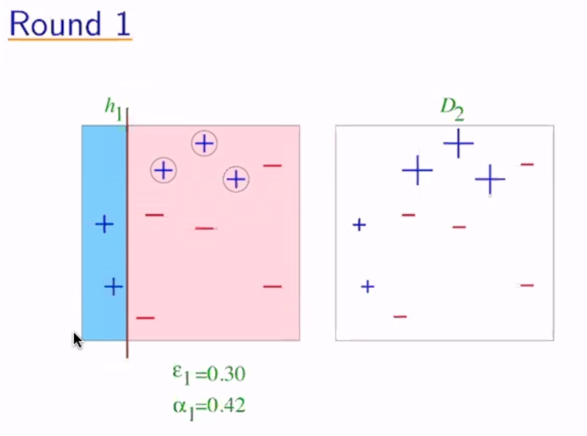
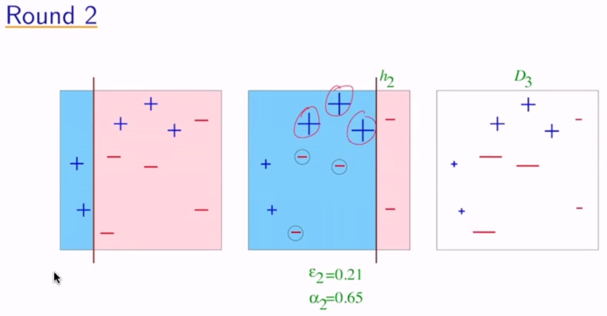
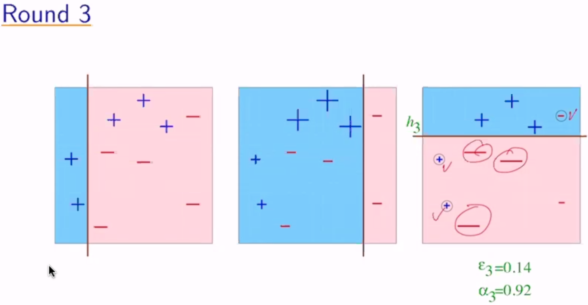
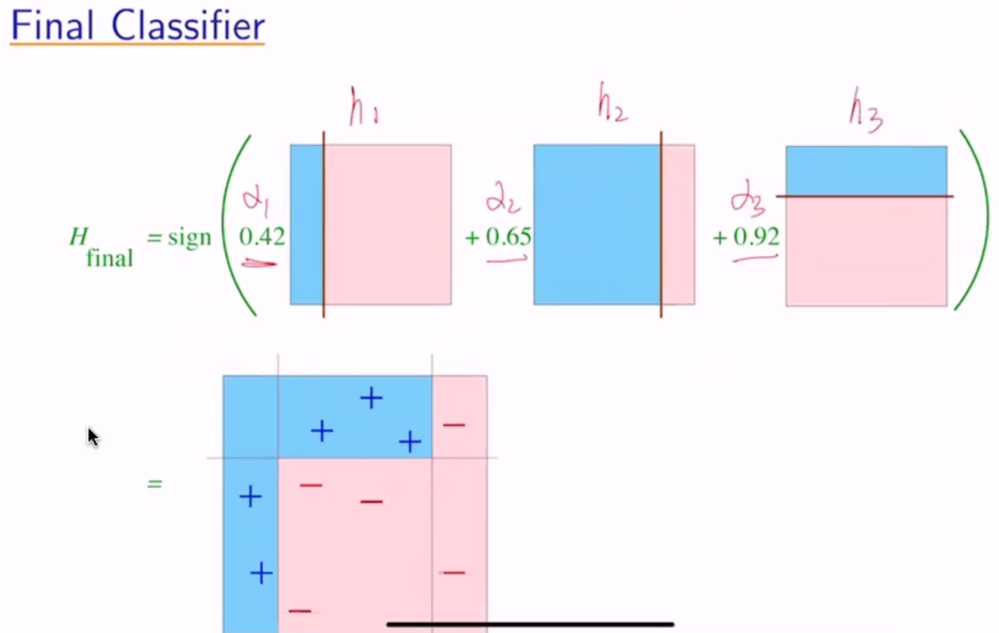

Ensemble/Boosting
=================

Ensemble Methods
----------------

- use an ensemble/group of hypotheses
- diversity important; ensemble of "yes-men" is useless
- get diverse hypotheses by using
    - different data
    - different algorithms
    - different hyperparameters

Why?

- averaging reduces variance
    - ensemble more stables than individual
    - consider biased coin p(head) = 1/3
        - variance on one flip = 1/3 - 1/9 = 2/9
        - variance on average of 2 flips = 2/9 - 1/9 = 1/9
- averaging makes less mistakes
    - consider 3 classifiers with accuracy 0.8, 0.7, and 0.7
    - the probability that the majority vote is correct = (f1 correct, f2 correct, f3 wrong) + (f1 correct, f2 wrong, f3 correct) + (f1 wrong, f2 correct, f3 correct) + (f1 correct, f2 correct, f3 correct)
    - = :math:`(.8*.7*.3) + (.8*.3*.3) + (.2*.7*.7) + (.8*.8*.7) \approx 0.82`

Creation
^^^^^^^^

- use different training sets
    - bootstrap example: pick *m* examples from labeled data with replacement
    - cross-validation sampling
    - reweight data (boosting, later)
- use different features
    - random forests "hide" some features

Prediction
^^^^^^^^^^

- unweighted vote
- weighted vote
    - pay more attention to better predictors
- cascade
    - filter examples; each level predicts or passes on

Boosting
--------

- "boosts" the preformance of another learning algorithm
- creates a set of classifiers and predicts with weighted vote
- use different distributions on sample to get diversity
    - up-weight hard, down-weight easy examples
- note: ensembles used before to reduce variance

If boosting is possible, then:

- can use fairly wild guesses to produce highly accurate predictions
- if you can learn "part way" you can learn "all the way"
- should be able to improve any learning algorithm
- for any learning problem:
    - either can learn always with nearly perfect accuracy
    - or there exist cases where cannot learn even slightly better than random guessing

Ada-Boost
^^^^^^^^^

Given a training sample S with labels +/-, and a learning algorithm L:

1. for t from 1 to T do
    1. create distribution :math:`D_t` on :math:`S`
    2. call :math:`L` with :math:`D_t` on :math:`S` to get hypothesis :math:`h_t`
        1. i.e. :math:`\min \sum_n D_t(n) l(f(x_n), y_n)` where :math:`D_t(n)` is the weight of the sample
    3. calculate weight :math:`\alpha_t` for :math:`h_t`
2. final hypothesis is :math:`F(x) = \sum_t \alpha_t h_t(x)`, or :math:`H(x)` = value with most weight

formally:

So how do we pick :math:`D_t` and :math:`\alpha_t`?

- :math:`D_1(i) = 1/m` - the weight assigned to :math:`(x_i, y_i)` at :math:`t=1`
- given :math:`D_t` and :math:`h_t`:
    - :math:`D_{t+1}(i) = \frac{D_t(i)}{Z_t} \exp(-\alpha_t y_i h_t(x_i))`
        - if correct, increase weights by a factor > 1 (positive exponential)
        - otherwise decrease by a factor < 1 (negative exponential)
    - where :math:`Z_t` is a normalization factor
    - where :math:`\alpha_t = \frac{1}{2} \ln (\frac{1-\epsilon_t}{\epsilon_t}) > 0`
- :math:`H_{final}(x) = sign(\sum_t \alpha_t h_t(x))`

**Example**:

now the weights become :math:`\frac{1}{10} e^{0.42}` for the misclassified and :math:`\frac{1}{10} e^{-0.42}` for the correct

Analyzing Error
^^^^^^^^^^^^^^^

Thm: Write :math:`\epsilon_t` as :math:`1/2 - \gamma_t` - :math:`\gamma_t` = "edge" = how much better than random guessing.
Then:

.. math::
    \text{training error}(H_{final}) & \leq \prod_t [2 \sqrt{\epsilon_t (1-\epsilon_t)}] \\
    & = \prod_t \sqrt{1-4\gamma_t^2} \\
    & \leq \exp(-2\sum_t \gamma_t^2)

So if :math:`\forall t: \gamma_t \geq \gamma > 0`, then :math:`\text{training error}(H_{final}) \leq e^{-2\gamma^2 T}`

therefore, as :math:`T \to \infty`, training error :math:`\to 0`

Proof
^^^^^

Let :math:`F(x) = \sum_t \alpha_t h_t(x) \to H_{final}(x) = sign(F(x))`

Step 1: unwrapping recurrence

.. math::
    D_{final}(i) & = \frac{1}{m} \frac{\exp(-y_i \sum_t \alpha_t h_t(x_i))}{\prod_t Z_t} \\
    & = \frac{1}{m} \frac{\exp(-y_i F(x_i))}{\prod_t Z_t}

Step 2: training error :math:`(H_{final}) \leq \prod_t Z_t`

.. math::
    \text{training error}(H_{final}) & = \frac{1}{m} \sum_i & 1 & \text{ if } y_i \neq H_{final}(x_i) \\
    & & 0 & \text{ otherwise} \\
    & = \frac{1}{m} \sum_i & 1 & \text{ if } y_i F(x_i) \leq 0 \\
    & & 0 & \text{ otherwise} \\
    & \leq \frac{1}{m} \sum_t \exp(-y_i F(x_i)) \\
    & = \sum_i D_{final}(i) \prod_t Z_t \\
    & = \prod_t Z_t

Step 3: :math:`Z_t = 2 \sqrt{\epsilon_t (1-\epsilon_t)}`

.. math::
    Z_t & = \sum_i D_t(i) \exp(-\alpha_t y_i h_t(x_i)) \\
    & = \sum_{i:y_i \neq h_t(x_i)} D_t(i)e^{\alpha_t} + \sum_{i:y_i = h_t(x_i)} D_t(i) e^{-\alpha_t} \\
    & = \epsilon_t e^{\alpha_t} + (1-\epsilon_t) e^{\alpha_t} \\
    & = 2 \sqrt{\epsilon_t (1-\epsilon_t)}

Discussion
^^^^^^^^^^

We expect even as training error approaches 0 as T increases, the test error won't - overfitting!

We can actually predict "generalization error" (basically test error):

.. math::
    \text{generalization error} \leq \text{training error} + \tilde{O}(\sqrt{\frac{dT}{m}})

Where :math:`m` = # of training samples, :math:`d` = "complexity" of weak classifiers, :math:`T` = # of rounds

But in reality, it's not always a tradeoff between training error and test error.

Margin Approach
"""""""""""""""

- training error only measures whether classifications are right or wrong
- should also consider confidence of classifications
- :math:`H_{final}` is weighted majority vote of weak classifiers
- measure confidence by *margin* = strength of the vote
    - = (weighted fraction voting correctly) - (weighted fraction voting incorrectly)
- so as we train more, we increase the margin, which leads to a decrease in test loss

- both AdaBoost and SVMs
    - work by maximizing margins
    - find linear threshold function in high-dimensional space
- but they use different norms

AdaBoost is:

- fast
- simple, easy to program
- no hyperparameters (except T)
- flexible, can combine with any learning algorithm
- no prior knowledge needed about weak learner
- provably effective (provided a rough rule of thumb)
- versatile

But:

- performance depends on data and weak learner
- consistent with theory, adaboost can fail if:
    - weak classifiers too complex (overfitting)
    - weak classifiers too weak (basically random guessing)
        - underfitting, or low margins -> overfitting
- susceptible to uniform noise
