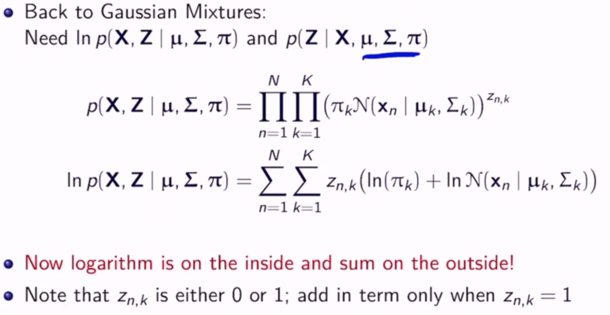
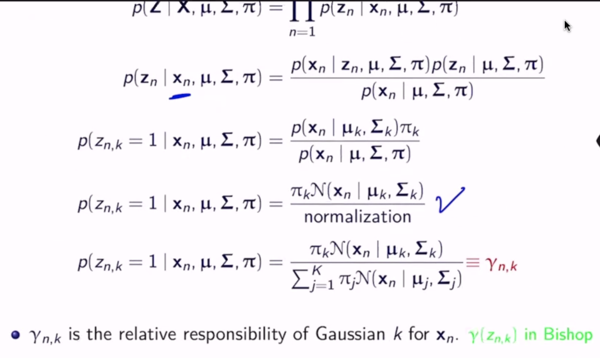
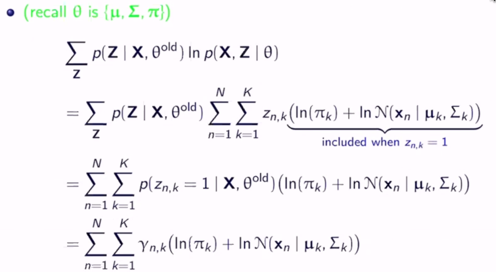
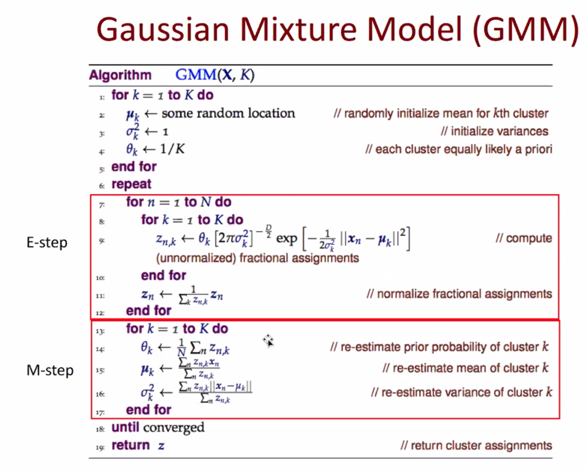

EM/GMM
======
Gaussian Mixture Models: Estimate Mixtures of :math:`K` Gaussians

- pick sample from gaussian :math:`k` with prob. :math:`\pi_k`
- generative distribution :math:`p(\mathbf{x}) = \sum_{k=1}^K \pi_k N(\mathbf{x} | \mathbf{\mu}_k, \mathbf{\Sigma}_k)`
    - where :math:`N` is the gaussian distibution
- a *mixture distribution* with mixture coefficients :math:`\mathbf{\pi}`
- for iid sample :math:`\mathbf{X}` and parameters :math:`\theta = \{\mathbf{\pi}, \mathbf{\mu}, \mathbf{\Sigma}\}`, we have:

.. math::
    p(\mathbf{X} | \mathbf{\pi}, \mathbf{\mu}, \mathbf{\Sigma}) & = \prod_{n=1}^N p(\mathbf{x_n} | \mathbf{\pi}, \mathbf{\mu}, \mathbf{\Sigma}) \\
    & = \prod_{n=1}^N \sum_{k=1}^K \pi_k N(\mathbf{x} | \mathbf{\mu}_k, \mathbf{\Sigma}_k)

What is :math:`\theta`?

Log-Likelihood
--------------

.. math::
    L(\pi, \mu, \Sigma) & = \ln p(\mathbf{X} | \mathbf{\pi}, \mathbf{\mu}, \mathbf{\Sigma}) \\
    & = \ln (\prod_{n=1}^N \sum_{k=1}^K \pi_k N(\mathbf{x} | \mathbf{\mu}_k, \mathbf{\Sigma}_k)) \\
    & = \sum_{n=1}^N \ln (\sum_{k=1}^K \pi_k N(\mathbf{x} | \mathbf{\mu}_k, \mathbf{\Sigma}_k))

This is very hard to solve directly!

Iteratively
-----------

- which gaussian picked for :math:`x_i \in X` is a latent variable :math:`z_i` in :math:`\{0, 1\}^K` (one of K encoding)
- :math:`Z` is vector of :math:`z_i`'s
- note that :math:`p(\mathbf{X} | \mathbf{\pi}, \mathbf{\mu}, \mathbf{\Sigma}) = \sum_Z p(\mathbf{X}, Z | \mathbf{\pi}, \mathbf{\mu}, \mathbf{\Sigma})`
- complete data is :math:`\{X, Z\}`
- incomplete data is just :math:`X`
- don't know :math:`Z`, but from :math:`\theta^{old}` can infer

Maximize this to get the new parameters.

