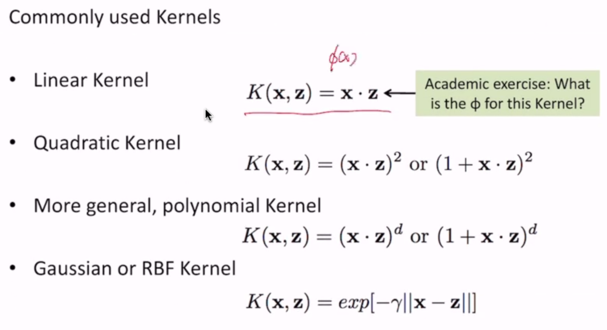
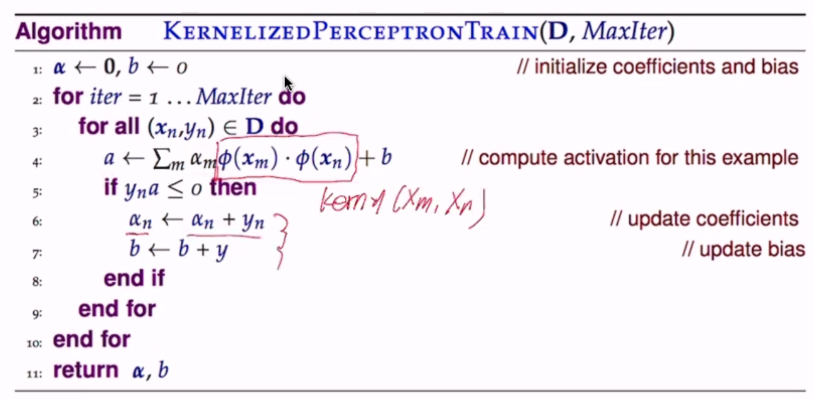

Kernel Methods
==============

- step 1: use a special type of mapping functions
    - still map feature space to a higher dimensional space
    - but computation of :math:`\phi(x) \cdot \phi(z)` is easy (remember the multiplication of features in SVM optimization)
- step 2: rewrite the model s.t.
    - the mapping :math:`\phi(x)` never needs to be explicitly computed - i.e. never compute terms like :math:`w \cdot \phi(x) + b`
    - only work with :math:`\phi(x) \cdot \phi(z)` - we call this the **kernel** function

**Ex.**

.. math::
    \mathbf{x} = <x_1, x_2> \to \phi(x) = <x_1^2, \sqrt{2}x_1 x_2, x_2^2>

We can compute :math:`\phi(x) \cdot \phi(z)` easily:

.. math::
    \phi(x) \cdot \phi(z) & = <x_1^2, \sqrt{2}x_1 x_2, x_2^2> \\
    & = <x_1^2, \sqrt{2}x_1 x_2, x_2^2> \cdot <z_1^2, \sqrt{2}z_1 z_2, z_2^2> \\
    & = ... \\
    & = (x \cdot z)^2 \\
    & = K(x, z)

We call this a **kernel** function

What about the quadratic feature mapping?

.. math::
    ... = (1+x \cdot z)^2 = K(x, z)

Kernel in SVM
-------------

Rewriting the primal form of the SVM to use the mapped space doesn't seem easy.

But we can rewrite the dual form easily!

.. math::
    \max & \sum_{n=1}^N \alpha_n - \frac{1}{2} \sum_{m,n=1}^N \alpha_m \alpha_n y_m y_n (\phi(x_m)^T \phi(x_n)) \\
    \text{subject to } & \sum_{n=1}^N \alpha_n y_n = 0, \alpha_n \geq 0; n = 1..N

**Kernelized SVM**

Now SVM is computing a linear boundary in the higher-dimensional space without actually transforming vectors

.. math::
    \max & \sum_{n=1}^N \alpha_n - \frac{1}{2} \sum_{m,n=1}^N \alpha_m \alpha_n y_m y_n (K(x_m, x_n)) \\
    \text{subject to } & \sum_{n=1}^N \alpha_n y_n = 0, \alpha_n \geq 0; n = 1..N

Predictions:

.. math::
    \hat{y} & = sign(\sum \alpha_n y_n x_n \cdot x' + b) \text{ (in the old space)} \\
    & \to sign(\sum \alpha_n y_n \phi(x_n) \cdot \phi(x') + b) \\
    & = sign(\sum \alpha_n y_n K(x_n, x') + b)

Formal Definition
-----------------
Let's use the example kernel :math:`K(x, z) = (x \cdot z)^2` for :math:`\phi(x) = <x_1^2, \sqrt{2}x_1x_2, x_2^2>`

- a kernel function is implicitly associated with some :math:`\phi`
- :math:`\phi` maps input :math:`x\in X` to a higher dimensional space :math:`F`:
    - :math:`\phi: X \to F`
- kernel takes 2 inputs from :math:`X` and outputs their similarity in F
    - :math:`K: X \times X \to R`
- once you have a kernel, you **don't need to know** :math:`\phi`

**Mercer's Condition**

- a function can be a kernel function K if a suitable :math:`\phi` exists
    - :math:`\exists \phi` s.t. :math:`K(x, z) = \phi(x) \cdot \phi(z)`
- mathematically: K should be positive semi-definite; i.e. for all square integrable f s.t. :math:`\int f(x)^2 dx < \infty`
    - :math:`\int \int f(x)K(x, z)f(z)dxdz > 0`
    - sufficient and necessary to identify a kernel function

**Constructing Kernels**

We already know some proven basic kernel functions - given Mercer's condition, we can construct new kernels!

- :math:`k(x, z) = k_1(x, z) + k_2(x, z)` (direct sum)
- :math:`k(x, z) = \alpha k_1(x, z)` (:math:`\forall \alpha > 0` - scalar product)

.. note::
    Example: given that k1 and k2 are kernels, prove :math:`k(x, z) = k_1(x, z) + k_2(x, z)` is a kernel

    .. math::
        \iint f(x)K(x, z)f(z)dxdz & = \iint f(x)[K_1(x, z) + K_2(x, z)]f(z)dxdz \\
        & = \iint f(x)K_1(x, z)f(z)dxdz + \iint f(x)K_2(x, z)f(z)dxdz \\
        & > 0 + 0

(:math:`\phi` for the linear kernel = :math:`\phi(x) = x`)

Perceptron
----------
we can also apply kernels to perceptron!

Naively, we can just replace :math:`\mathbf{x}` with :math:`\phi(x)` in the algorithm - but that requires knowledge
of :math:`\phi`

**Prediction**

since :math:`w = \sum_m \alpha_m \phi(x_m)`, prediction on :math:`x_n` is easy:

.. math::
    \hat{y_n} = sign(\sum_m \alpha_m \phi(x_m) \cdot \phi(x_n) + b)