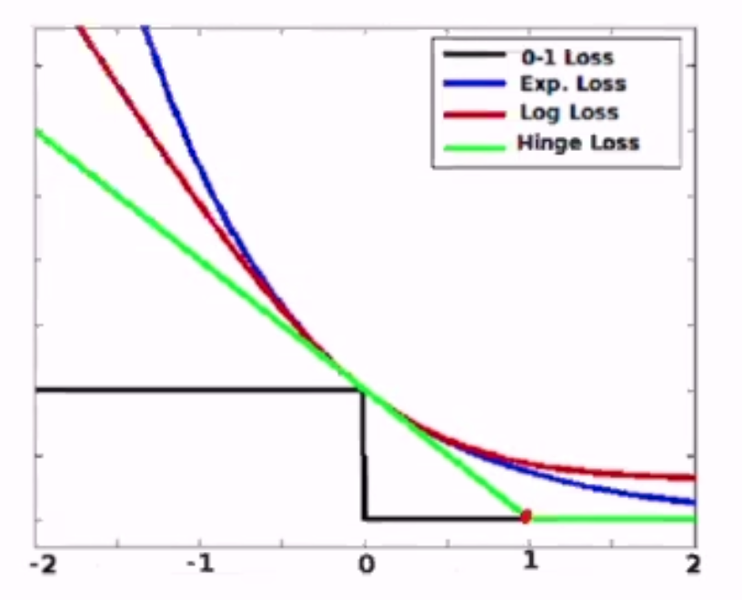
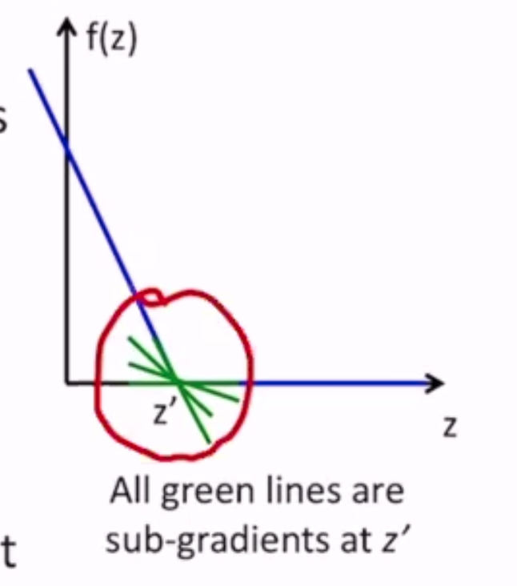

Linear Models
=============

If your data is linearly separable, perceptron will find you a separating hyperplane.

But what if my data isn't linearly separable?

- perceptron will find a hyperplane that makes some errors
- what about a hyperplane that makes a *minimal* amount of errors?

Minimum Error Hyperplane
------------------------

The error of a linear model :math:`(\mathbf{w}, b)` for an instance :math:`(\mathbf{x_n}, y_n)` is:

.. math::
    \mathbf{1} [y_n (\mathbf{w} \cdot \mathbf{x_n} + b) \leq 0]

where :math:`\mathbf{1}` is an indicator function that returns 1 on incorrect prediction and 0 on correct
(0-1 loss)

Based on this, we can make an objective to minimize the minimum error hyperplane:

.. math::
    \min_{\mathbf{w}, b} \sum_n \mathbf{1} [y_n (\mathbf{w} \cdot \mathbf{x_n} + b) \leq 0]

This is ERM: **empirical risk minimization**.

But there are problems:

- the loss fcn is not convex
- not differentiable

Alternatives to 0-1 Loss
^^^^^^^^^^^^^^^^^^^^^^^^
We need to find an upper-bound to 0-1 loss that is convex, so that minimization is easy. Also, minimizing the upper
bound of the objective pushes down the real objective.

Given :math:`y, a` (label, activation):

- 0/1: :math:`l^{(0/1)}(y, a) = 1[ya \leq 0]`
- hinge: :math:`l^{(hin)}(y, a) = \max\{0, 1-ya\}`
- logistic: :math:`l^{(log)}(y, a) = \frac{1}{\log 2} \log(1 + \exp[-ya])`
- exponential: :math:`l^{(exp)}(y, a) = \exp[-ya]`

These are all convex functions and can be minimized using SGD - except for hinge loss at point 1.

Sub-gradient Descent
^^^^^^^^^^^^^^^^^^^^
How do we minimize a non-differentiable function?

- apply GD anyway, where it exists
- at non-diff points, use a sub-gradient
- sub-gradient of :math:`f(z)` at a point :math:`z'` is the set of all lines that touch :math:`f(z)` at :math:`z'` but lie below :math:`f(z)`
- at diff points, the sub gradient is the gradient

