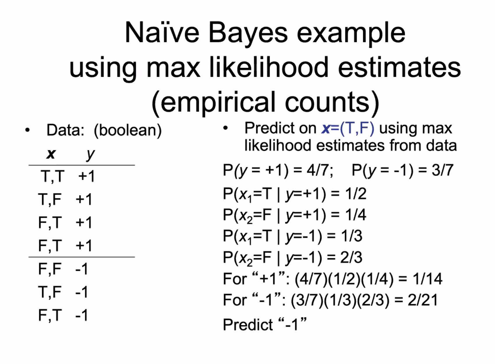

Naive Bayes
===========

TLDR: predict the likelihood of the label, given features

.. math::
    & \arg \max_y P(y | \mathbf{x}) \\
    & = \arg \max_y P(\mathbf{x} | y) \frac{P(y)}{P(\mathbf{x})} \\
    & = \arg \max_y P(\mathbf{x} | y) P(y)

Naive independence assumption: the attributes are conditionally independent given *y*, i.e.

.. math::
    P(\mathbf{x} | y) = \prod_j P(x_j | y)

So, we predict the label *y* that maximizes

.. math::
    P(y) \prod_j P(x_j | y)

This uses a *generative* model: pick *y* then generate **x** based on *y*

To implement naive bayes, we need to **estimate**:

- :math:`P(y)` distribution
- for each class *y*, for each feature :math:`x_j`, need :math:`P(x_j | y)` distributions

all of these features are 1-dimensional - the combination of them is the model

Issues
^^^^^^

- conditional independence is optimistic
- what if an attribute-value pair is not in the training set?
    - laplace smoothing / dummy data
- continuous features: use gaussian or other density?
- attributes for text classification?
    - bag of words model

NB for Text
^^^^^^^^^^^

- let :math:`V` be the vocabulary (all words/symbols in training docs)
- for each class :math:`y`, let :math:`Docs_y` by the concatenation of all docs labelled *y*
- for each word :math:`w` in :math:`V`, let :math:`\#w(Docs_y)` be the number of times :math:`w` occurs in :math:`Docs_y`
- set :math:`P(w | y) = \frac{\#w(Docs_y) + 1}{|V| + \sum_w \#w(Docs_y)}` (Laplacian smoothing)
