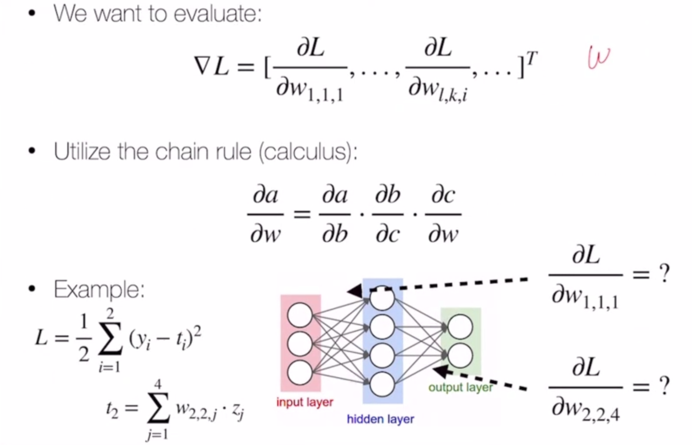
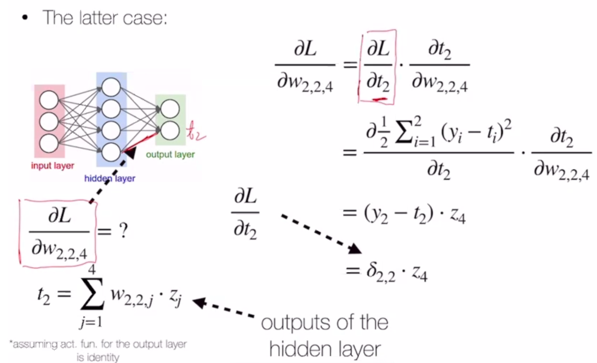
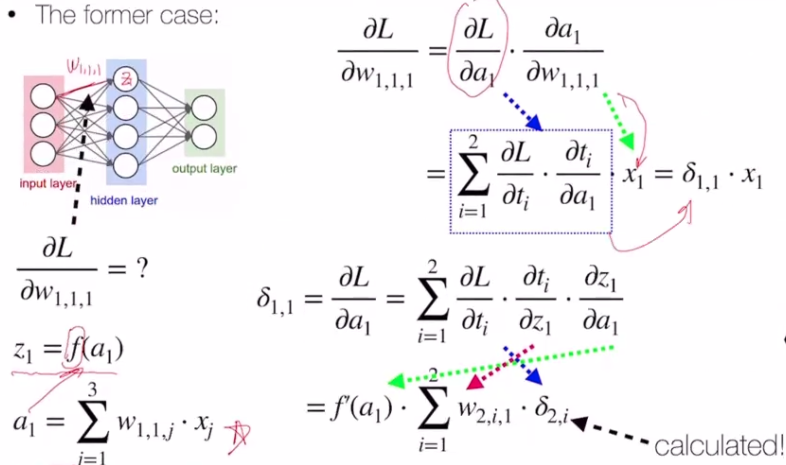
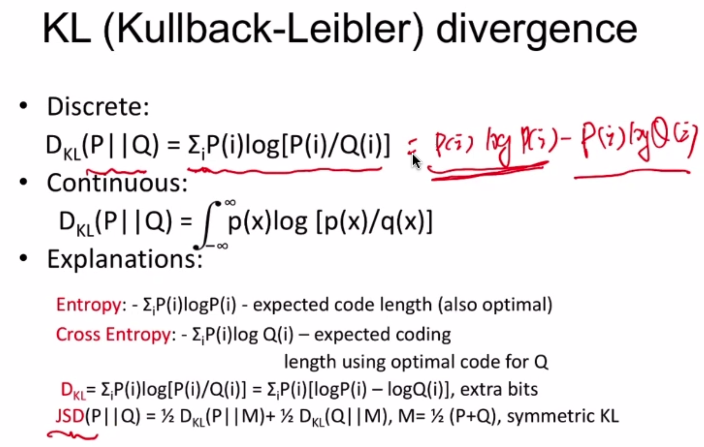

Neural Nets
===========

Neural nets can be used to approximate nonlinear functions with a hypothesis!

Neural nets are an intuitive extension of perceptron - think of perceptron as a 1-layer neural net.

But in perceptron, the output is just the sign of the linear combination of the inputs - in NN, we use an
*activation function*

.. math::
    sign(W_i \cdot x) \to f(W_i \cdot x)

Activations should be nonlinear - if they're linear, it's redundant

Activations
-----------

- sign: -1, 0, or 1
    - not differentiable
    - often used for output layer
- tanh: :math:`\frac{e^{2x}-1}{e^{2x}+1}`
- sigmoid: :math:`\frac{e^x}{1+e^x}`
- ReLU: :math:`\max(0, x)`

Training
--------
Let's consider the following loss objective on a 2-layer neural net with weights W and v:

.. math::
    L(w, v) = \min_{W,v} \sum_n \frac{1}{2} (y^n - score)^2

we just need to find

.. math::
    \frac{\partial L}{\partial W}, \frac{\partial L}{\partial v}

We do this using *backpropogation*.

VAE
---
Whereas normal AE turns images into a latent vector, VAE tries to learn the parameters of a gaussian distribution
that the image is a mixture of

.. math::
    c_i = \exp(\sigma_i)e_i + m_i

where :math:`c_i` is a component of the latent vector, :math:`e_i` is a random exponential term, and
:math:`m_i` and :math:`\sigma_i` are the gaussian variables.

KL Divergence
-------------

Roughly, a measure of how close two distributions are to each other (>= 0)

Random
------

Random note: GAN objective can also be written :math:`\max_D V(G,D) = -2 \log 2 + 2 JSD(P_{data}(x) || P_G(x))`

f-GAN
^^^^^

Uses a generalized divergence function:

.. math::
    D_f(q||p) = \int p(x) f[\frac{q(x)}{p(x)}]dx

by making :math:`f = \log`, this is KL divergence