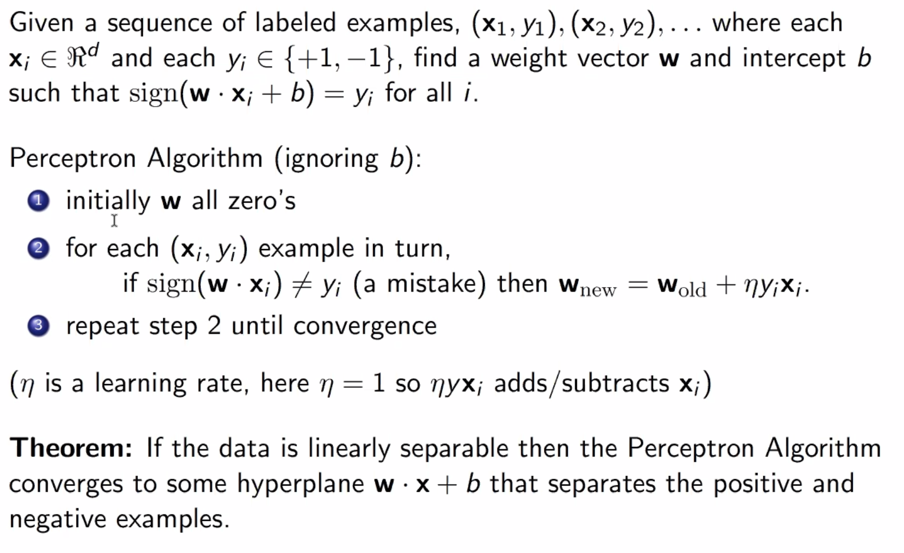

Perceptron
==========

Perceptron is a linear, online classification model

Given a training set of pairs, it learns a linear decision boundary hyperplane - we assume labels are binary for now

It's inspired by neurons: activation is a function of its inputs and weights. For example, the weighted sum activation:

.. math::
    activation = \sum_{i=1}^D w_ix_i

Then, prediction can be something like ``a > 0 ? 1 : -1``.

Additionally, we can add a bias term to account for a non-zero intercept:

.. math::
    a = [\sum_{i=1}^D w_ix_i] + b

Linear Boundary
---------------

- a ``D-1`` dimensional hyperplane separates a ``D`` dimensional space into two half-spaces: positive and negative
- this linear boundary has the form :math:`\mathbf{w} \cdot \mathbf{x} = 0`
    - defined by **w**: the unit vector (often normalized) normal to any vector on the hyperplane
- :math:`\text{proj}_w x` is how far away *x* is from the decision boundary
    - when **w** is normalized to a unit vector, :math:`\mathbf{w} \cdot \mathbf{x} = \text{proj}_w x`.

**With Bias**

- When a bias is added, the linear boundary becomes :math:`\mathbf{w} \cdot \mathbf{x} + b = 0`
    - this can be converted to the more general form :math:`\mathbf{w} \cdot \mathbf{x} = 0` by adding *b* to **w** and an always-1 feature to **x**

Prediction
----------
Pretty simple:

.. code:: py

    def prediction(w, x, b):
        return sign( w @ x + b )

Training
--------

This is an error-driven model:

1. initialize model to some weights and biases
2. for each instance in training set:
    1. use current **w** and *b* to predict a label :math:`\hat{y}`
    2. if :math:`\hat{y} = y` do nothing
    3. otherwise update **w** and *b* to do better
3. goto 2

Update in a little simpler notation:

.. math::
    \mathbf{w} & = \mathbf{w} + y \mathbf{x} \\
    b & = b + y

So what does it do? Let's look at the new activation after an update where a positive was incorrectly predicted as a negative label:

So for the given example, the activation is improved by a factor of positive :math:`\sum_{i=1}^D x_i^2 + 1`, bringing
the prediction closer to correctiveness for that one sample.

We can also control the learning rate easily using a term :math:`\eta`:

.. math::
    \mathbf{w} = \mathbf{w} + y \eta \mathbf{x}

Caveats
^^^^^^^

- the order of the training instances is important!
    - e.g. all positives followed by all negatives is bad
    - recommended to permute the training data after each iteration

Example
-------

.. code:: text

    x1 x2 y  wx  w (after update, if any)
    -------------------------------------
                 <0, 0>
     1  3  +   0 <1, 3>
     2  3  -  11 <-1, 0>
    -3  1  +   3 <-1, 0>
     1 -1  -  -1 <-1, 0>

Convergence
-----------
We can define convergence as when going through the training data once, no updates are made

If the training data is linearly separable, perceptron will converge - if not, it will never converge.

How long perceptron takes to converge is based on how *easy* the dataset is - roughly, how separated from each
other the two classes are (i.e. the higher the *margin* is, the easier the dataset is, where *margin* is the distance
from the hyperplane to a datapoint)

Proof
^^^^^

**Overview**

**Steps**

**Simplification 1**

**Simplification 2**

**Simplification 3**

**Analysis Setup**

**Finishing Up**

