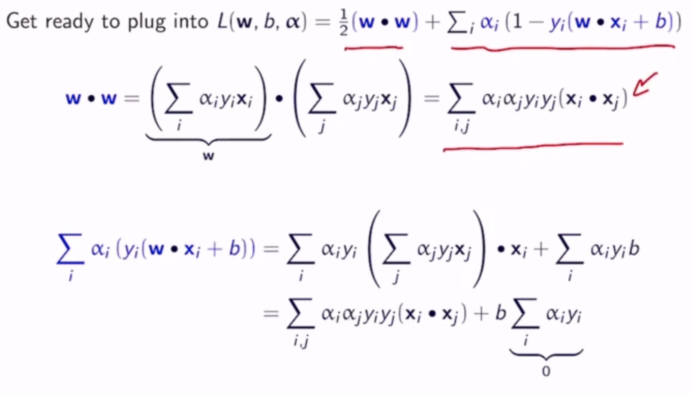
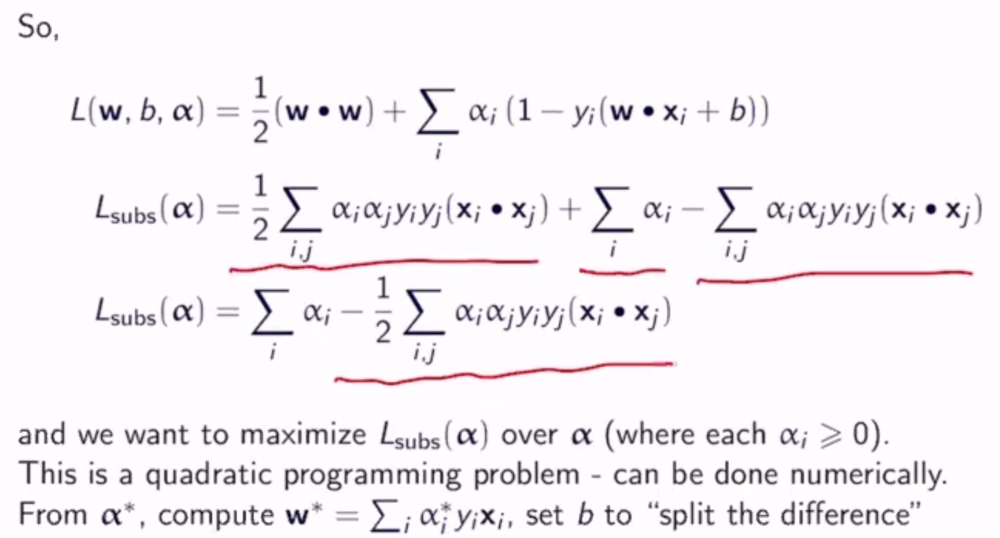
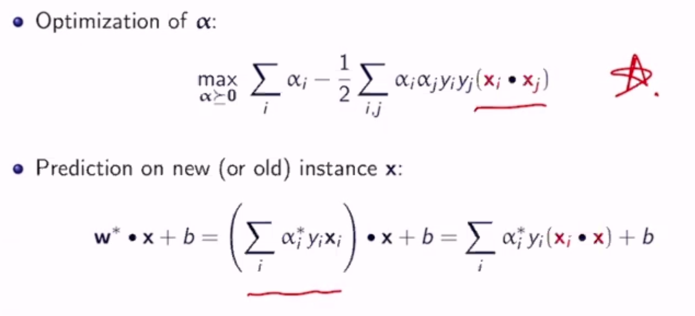
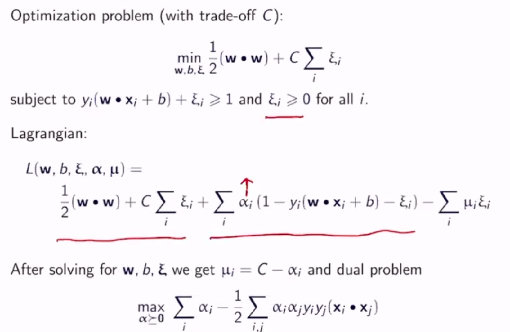
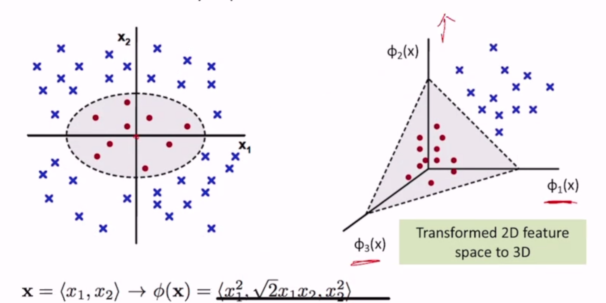

SVMs
====

.. note::
    On the homework:

    .. math::
        & P(GPA=x|type=N) \\
        & = \frac{1}{\sqrt{2\pi \sigma_N^2}} \exp(\frac{-(x-\mu_N)^2}{2\sigma_N^2})

    How do we estimate :math:`\mu` and :math:`\sigma` from the data?

    1. :math:`\arg \max_{\mu, \sigma} P(GPA1, GPA2..GPA6|\mu, \sigma)`
    2. :math:`\hat{\mu}_N = avg(GPA)`

Support Vector Machines

Max-Margin Classification
-------------------------
This is a linearly separable dataset, and all these hyperplanes are valid, but which one is *best*?

- The blue one has the largest *margin*
- **Margin**: Distance between the hyperplane and the nearest point
    - defined for a given dataset :math:`\mathbf{D}` and hyperplane :math:`(\mathbf{w}, b)`

.. math::
    margin(\mathbf{D}, \mathbf{w}, b) = & \min_{(x, y)\in \mathbf{D}} y(\mathbf{w \cdot x} + b) & \text{ if w separates D} \\
    & -\inf & \text{ otherwise}

SVM is a classification algorithm that tries to find the *maximum margin* separating hyperplane.

Hard SVM
--------

Setup
^^^^^

- Input: training set of pairs :math:`<x_n, y_n>`
    - :math:`x_n` is the D-dimensional feature vector
    - :math:`y_n` is the label - assume binary :math:`\{+1, -1\}`
- Hypothesis class: set of all hyperplanes H
- Output: :math:`w` and :math:`b` of the maximum hypotheses :math:`h\in H`
    - :math:`w` is a D-dimensional vector (1 for each feature)
    - :math:`b` is a scalar

Prediction
^^^^^^^^^^

- learned boundary is the maximum-margin hyperplane specified by :math:`w, b`
- given a test instance :math:`x'`, prediction :math:`\hat{y} = sign(w \cdot x' + b)`
- if the prediction is correct, :math:`\hat{y}(w \cdot x' + b) > 0`

Intuition
^^^^^^^^^

But :math:`y * activation` is a weak condition - let's increase it to be "sufficiently" positive

**Final Goal**: Find w, b that minimize 1/margin s.t. y * activation >= **1** for all points

Optimization
^^^^^^^^^^^^

.. math::
    \min_{w, b} & \frac{1}{\gamma(w, b)} \\
    \text{subj. to } & y_n(w \cdot x_n + b) \geq 1 (\forall n)

Where :math:`\gamma` is the distance from the hyperplane to the nearest point

- maximizing :math:`\gamma` = minimizing :math:`1/\gamma`
- constraints: *all* training instances are correctly classified
    - we have a 1 instead of 0 in the condition to ensure a non-trivial margin
    - this is a hard constraint, and so called a hard-margin SVM
- what about for non linearly-separable data?
    - infeasible solution (feasible set is empty): no hyperplane tielded
    - let's loosen the constraint slightly

Soft-Margin SVMs
----------------

- introduce one slack variable :math:`\xi_n` for each training instance
- if a training instance is classified correctly, :math:`\xi_n` is 0 since it needs no slack
    - but :math:`\xi_n` can even be >1 for incorrectly classified instances
    - if :math:`\xi_n` is 0, classification is correct
    - if :math:`0 < \xi_n < 1`, classification is correct but margin is not large enough
    - if :math:`\xi_n > 1`, classification is incorrect
- where :math:`C` is a hyperparameter (how much to care about slack)
    - if the slack component of the objective function is 0, it's the same goal as a hard-margin SVM

TLDR: maximize margin while minimizing total cost the model has to pay for misclassification that happens while obtaining this margin

Discussion
----------
Note that the max-margin hyperplane lies in the middle between the positive and negative points

- So the margin is determined by only 2 data points, that lie on the lines :math:`w \cdot x + b = 1` and :math:`w \cdot x + b = -1`
- these points, :math:`x_+` and :math:`x_-`, are called support vectors

.. note::
    :math:`w \cdot x_1 + b` is 0 since :math:`x_1` is on the decision boundary

    :math:`w \cdot x_\gamma = 1` -> :math:`||w||*||x_\gamma|| = 1` since :math:`w, x_\gamma` are parallel

Therefore, we can modify the objective:

.. math::
    \min_{w, b, \xi} & \frac{1}{2}||w||^2 + C\sum_n \xi_n & \\
    \text{subj. to } & y_n(w \cdot x_n + b) \geq 1 - \xi_n & (\forall n) \\
    & \xi_n \geq 0 & (\forall n)

Or, intuitively, finding the smallest weights possible.

Hinge Loss
----------
We can write the slack variables in terms of :math:`(w, b)`:

.. math::
    \xi_n = & 0 & \text{ if } y_n(w\cdot x_n + b) \geq 1 \\
    & 1 - y_n(w\cdot x_n + b) & \text{ otherwise}

which is hinge loss! Now, the SVM objective becomes:

.. math::
    \min_{w, b} \frac{1}{2}||w||^2 + C\sum_n l^{(hin)}(y_n, w\cdot x_n + b)

Solving
-------

Hard-Margin SVM
^^^^^^^^^^^^^^^

.. math::
    \min_{w, b} & \frac{1}{2}||w||^2 \\
    \text{subj. to } & y_n(w \cdot x_n + b) \geq 1 (\forall n)

- convex optimization problem
- specifically a *quadratic programming problem*
    - minimizing a function that is quadratic in vars
    - constraints are linear
- this is called the *primal form*, but most people solve the *dual form*

We can encode the primal form algebraically:

.. math::
    \min_{w, b} \max_{\alpha \geq 0} \frac{1}{2}(w \cdot w) + \sum_i \alpha_i (1-y_i(w \cdot x_i + b))

Dual Form
^^^^^^^^^

- does not change the solution
- introduces new variables :math:`\alpha_n` for each training instance

.. math::
    \max & \sum_{n=1}^N \alpha_n - \frac{1}{2} \sum_{m,n=1}^N \alpha_m \alpha_n y_m y_n (x_m^T x_n) \\
    \text{subject to } & \sum_{n=1}^N \alpha_n y_n = 0, \alpha_n \geq 0; n = 1..N

Once the :math:`\alpha_n` are computed, **w** and b can be computed as:

.. math::
    w = \sum_{n=1}^N \alpha_n y_n x_n \\
    b = \text{something...}

As it turns out, most :math:`\alpha_i`'s are 0 - only the support vectors are not

**For Soft-Margin SVM**

.. math::
    \max & \sum_{n=1}^N \alpha_n - \frac{1}{2} \sum_{m,n=1}^N \alpha_m \alpha_n y_m y_n (x_m^T x_n) \\
    \text{subject to } & \sum_{n=1}^N \alpha_n y_n = 0, 0 \leq \alpha_n \leq C; n = 1..N

For soft-margin SVMs, support vectors are:

- points on the margin boundaries (:math:`\xi = 0`)
- points in the margin region (:math:`0 < \xi < 1`)
- points on the wrong side of the hyperplane (:math:`\xi \geq 1`)

**Conclusion**: w and b only depend on the support vectors

Derivation
""""""""""

Given the algebriaecally encoded primal form:

.. math::
    \min_{w, b} \max_{\alpha \geq 0} \frac{1}{2}(w \cdot w) + \sum_i \alpha_i (1-y_i(w \cdot x_i + b))

We can switch the order of the min and max:

.. math::
    \max_{\alpha \geq 0} \min_{w, b} \frac{1}{2}(w \cdot w) + \sum_i \alpha_i (1-y_i(w \cdot x_i + b)) \\
    = \max_{\alpha \geq 0} \min_{w, b} L(w, b, \alpha)

To solve inner min, differentiate L wrt w and b:

.. math::
    \frac{\partial L(w, b, \alpha)}{\partial w_k} & = w_k - \sum_i \alpha_i y_i x_{i,k} &  \\
    \frac{\partial L(w, b, \alpha)}{\partial w} & = w - \sum_i \alpha_i y_i x_i & \to w = \sum_i \alpha_i y_i x_i \\
    \frac{\partial L(w, b, \alpha)}{\partial b} & = - \sum_i \alpha_i y_i & \to \sum_i \alpha_i y_i = 0

- :math:`w = \sum_i \alpha_i y_i x_i` means **w** is a weighted sum of examples
- :math:`\sum_i \alpha_i y_i = 0` means positive and negative examples have the same weight
- :math:`\alpha_i > 0` only when :math:`x_i` is a support vector, so **w** is a sum of signed *support vectors*

**Conclusion**

**Soft-Margin**

subject to :math:`0 \leq \alpha_i \leq c` :math:`(\forall i)`

Non-Linearly-Seperable
----------------------

What if our data is not linearly seperable?

- use a non-linear classifier
- transform our data so that it is, somehow
    - e.g. adding a dummy dimension based on a quadratic formula of the real dimension

Feature Mapping
^^^^^^^^^^^^^^^
We can map the original feature vector to a higher dimensional space :math:`\phi(x)`

e.g. quadratic feature mapping:

.. math::
    \phi(x) = < & 1, 2x_1, 2x_2, ..., 2x_D, \\
    & x_1^2, x_1x_2, ..., x_1x_D, \\
    & x_2x_1, x_2^2, ..., x_2x_D, \\
    & ... >

Pros: this improves separability, you can apply a linear model more confidently

Cons: There are a lot more features now, and a lot of repeated features - lots of computation and easier to overfit

