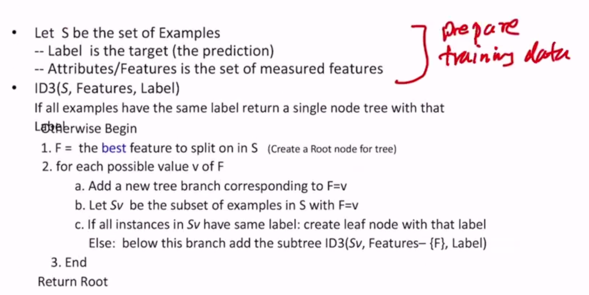
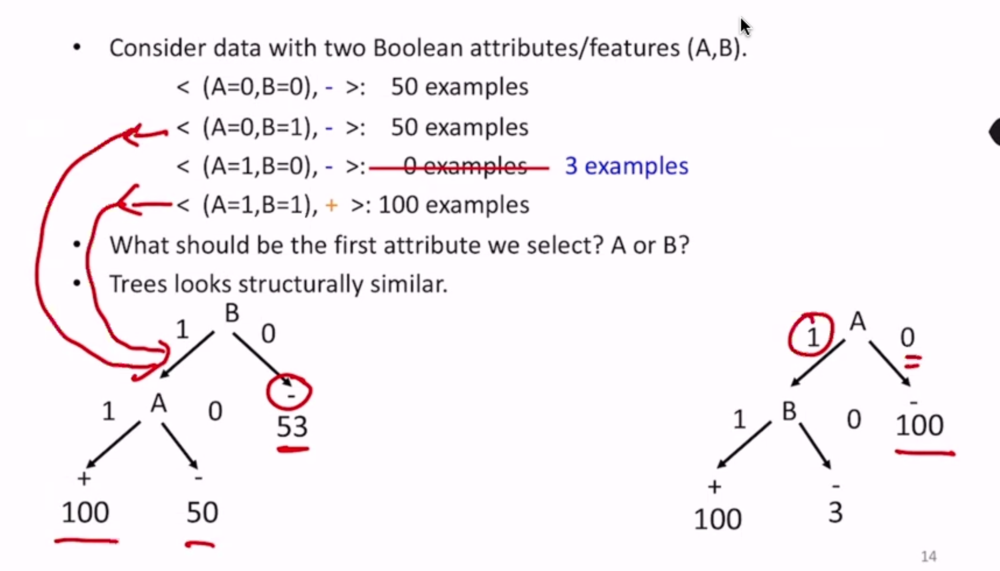

Decision Trees
==============

Let's take the example of whether or not to play tennis given 4 features - a binary classification question
based on discrete features.

To construct, pick a feature and split on it - then recursively build the tree top down

Algorithm
---------

ID3 = Iterative Dichotomizer

How do we choose the "best" feature?

- Our goal is to build a tree that is as small as possible - Occam's Razor
    - select a hypothesis that makes minimal assumptions
- finding the minimal tree is NP-hard
- this algorithm is greedy-heuristic, but cannot guarantee optimality
- the main heuristic is the definition of "best"

"Best"
-------

Example
^^^^^^^

Take the dataset:

.. code-block:: text

    (A=0,B=0), -: 50 examples
    (A=0,B=1), -: 50 examples
    (A=1,B=0), -: 0 examples
    (A=1,B=1), +: 100 examples

In this case, it's easy to tell we should split on A.

But what about:

We prefer the right tree (split on A) because statistically it requires fewer decisions to get to a prediction. But
how do we quantify this?

We should choose features that split examples into "relatively pure" examples. This is based on information gain.

Entropy
^^^^^^^

Entropy of a set of examples S relative to a binary classification task is: (also denoted :math:`H(S)`)

.. math::
    Entropy(S) = -p_+ \log_2(p_+) - p_- \log_2(p_-)

Where :math:`p_+` is the proportion of examples in S that belong to positive class, and vice versa

Generalized to K classes:

.. math::
    Entropy(S) = \sum_{i=1}^K -p_i \log_2(p_i)

The lower the entropy, the less uncertainty there is in a dataset.

**Ex.** When all examples belong to one class, entropy is 0. When all examples are exactly split across all classes
(in binary case), entropy is 1.

Information Gain
^^^^^^^^^^^^^^^^
The information gain of an attribute :math:`a` is the expected reduction in entropy caused by partitioning on this
attribute:

.. math::
    Gain(S, a) = Entropy(S) - \sum_{v \in values(a)} \frac{|S_v|}{|S|}Entropy(S_v)

where :math:`S_v` is the subset of a for which the value of attribute :math:`a` is :math:`v`.

This takes the averaged entropy of all partitions, and the entropy of each partition is weighted by its "contribution"
to the size of S.

Partitions of low entropy (low uncertainty/imbalanced splits) result in high gain

So this algorithm (ID3) makes statistics-based decisions that uses *all data*

Overfitting
-----------

- Learning a tree that perfectly classifies the data may not create the tree that best generalizes the training data
    - may be noise
    - might be making decisions based on very little data
- causes:
    - too much variance in training data
    - we split on features that are irrelevant

Pruning
^^^^^^^
Pruning is a way to remove overfitting

- remove leaves and assign majority label of parent to all items
- prune the children of S if:
    - all children are leaves
- how much to prune?
    - prune if the accuracy on the *validation set* does not decrease upon assigning the most frequent class label to all items at S

2 basic approaches:

- post-pruning: grow the full tree then remove nodes that don't have sufficient evidence
- pre-pruning: stop growing the tree at some point during construction when it is determined that there is not enough data to make reliable choices

Note that not all leaves in a pruned tree have to be pure. How do we decide the label at a non-pure leaf?

Random Forests
^^^^^^^^^^^^^^
Another way to avoid overfitting

- learn a collection of decision trees instead of a single one
- predict the label by aggregating all the trees in the forest
    - voting for classification, averaging for regression

Continuous Attributes
---------------------
TLDR:

- split on feature that gives largest drop in MSE
- split continuous variables into discrete variables (small, medium, large, etc)
    - what thresholds to use for these splits?
        - e.g. sort examples on feature, for each ordered pair with different labels consider if there is a threshold
        - midpoint or on the endpoint?

Missing Values
--------------
Options:

- throw away the instance
- fill in the most common value of the feature
- fill in with all possible values of the feature
- guess based on correlations with other features/labels

Other Issues
------------

- noisy labels
    - two identical instances with conflicting labels
- attributes with different costs
    - change information so that low cost attributes are preferred