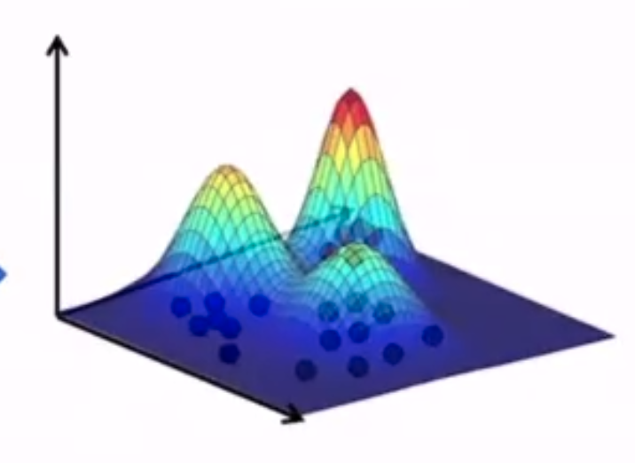
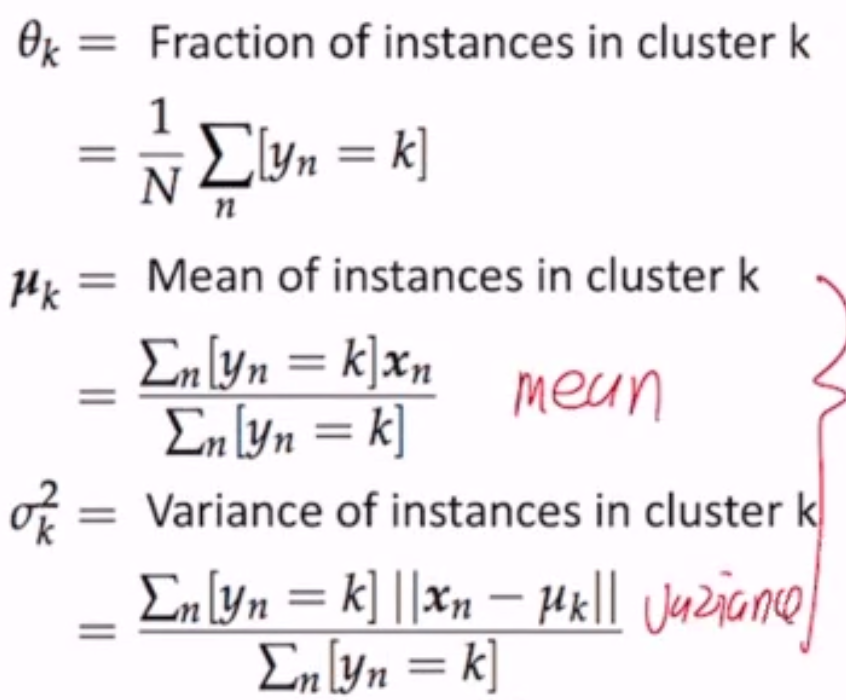
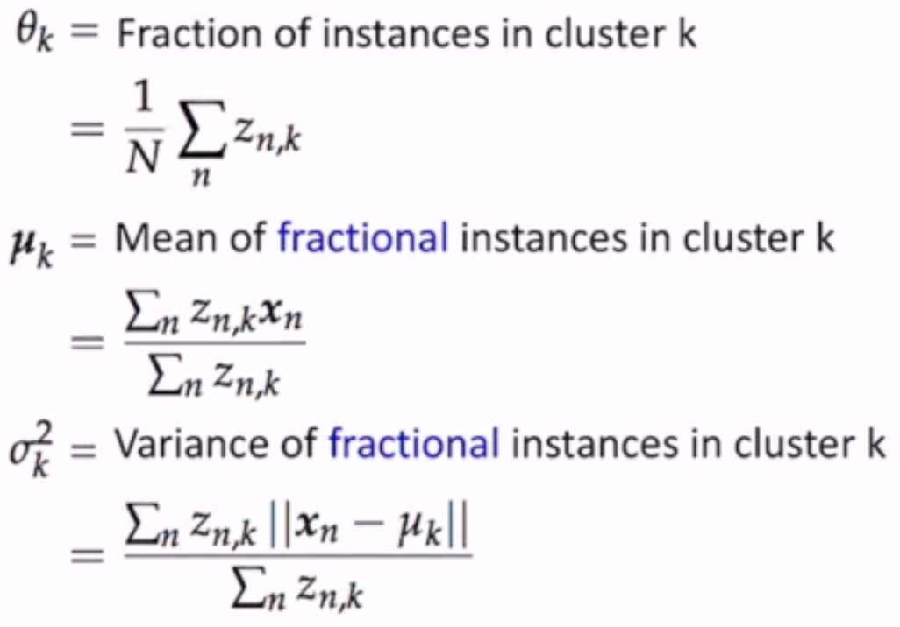

Unsupervised Learning
=====================

Getting supervised data is expensive and time-consuming; let's make sense of the data w/o labels

Today: K-means clustering

- Algorithm
- Convergence
- Initialization
- Hyperparameter selection
    - how many classes?

In some cases, different clustering algorithms can output different clusters (e.g. multicolored squares/circles -
split on shape or color?)

Algorithm
---------
In a clustering problem, each instance is just a data vector :math:`\mathbf{x}` without a label.

Let's use k-means clustering.

Pseudocode:

.. code-block:: text

    assign cluster centers randomly
    while centers are changing:
        assign each example to the closest center (least square distance)
        compute the new centers according to the assignments

But note that there can be many stop conditions - a certain number of iterations, when the centers stop changing,
or some other rule

.. code-block:: python
    :linenos:

    def k_means(D, k):
        for k = 1 to K:  # random init
            mu_k = some random location

        while mus changing:
            for n = 1 to N:  # assign to closest center
                z_n = argmin_k ||u_k - x_n||

            for k = 1 to K:  # compute new centers
                X_k = {x_n | z_n = k}
                mu_k = Mean(X_k)

        return z

Convergence
-----------
K-means is guaranteed to converge - i.e. there is some loss function, and it stops changing after some time.

So what does it optimize? The sum of the squared distance of points from their cluster means!

.. math::
    L(z,\mu; D) = \sum_N ||x_n - \mu_{z_n}||^2 = \sum_k \sum_{n:z_n=k} ||x_n - \mu_k||^2

where :math:`z` is the assignments of each point and :math:`\mu` is the location of each cluster center.

**Lemma 1**: Given a set of K points, the point m that minimizes the squared distances of all points to m is the mean
of the K points.

**Theorem**: For any dataset and any number of clusters, the K-means algorithm converges in a finite number of
iterations.

How to prove:

- focus on where in the algorithm the loss is decreasing
    - lines 7, 11
- prove that loss can only decrease at those points
    - at line 7, :math:`||x_n - \mu_b|| \leq ||x_n - \mu_a||` where a is old and b is new
    - at line 11, by lemma 1, the total sum of the squared distances decreases as the mean is the point that minimizes the squared distances of all points in each cluster
- prove that loss cannot decrease forever - there exists a lower bound reachable in a finite number of steps
    - the lower bound is 0, when each training point is the center of a cluster
    - :math:`\mu` is always the means of some subset of data, and there are a finite number of values for :math:`\mu`

This proves convergence.

But... what does it converge to?

- it's not guaranteed to converge to the "right answer"
- not even guaranteed to converge to the same answer each time (depends on initialization)

Initialization
--------------
How do we find the best answer given that it depends on initialization?

1. run a lot of times and pick the solution with mimimum loss
2. pick certain initialization points

Furthest-First
^^^^^^^^^^^^^^

- pick initial means as far from each other as possible
- pick a random example and set it as the mean of the first cluster
- for ``2..K``, pick the example furthest away from each picked one

Note: this initialization is sensitive to outliers, but this effect is usually reduced after the first few iterations

**Probabilistic Tweak**

- pick a random example and set it as the mean of the first cluster
- for ``2..K``, :math:`\mu_k` is sampled from points in the dataset s.t. the probability of choosing a point is proportional to its distance from the closest other mean
- has better theoretical guarantees

How to choose K
---------------
How do we choose K when there are an unknown number of clusters?

- if you pick K with the smallest loss, K=n has loss = 0
- "regularize" K via the BIC/AIC (Bayes Info Criteria/Akaike IC)
    - increasing K decreases the first term, but increases the second term

BIC: (where D is the # of training instances)

.. math::
    \arg \min_K \hat{L}_K + K \log D

AIC:

.. math::
    \arg \min_K \hat{L}_K + 2KD

Probabilistic Clustering
-------------------------

**Unobserved Variables**

- also called hidden/latent variables
- not missing values; just not observed in the data
- e.g.:
    - imaginary quantity meant to provide simplification
    - a real world object/phenomena that is difficult or impossible to measure
    - a object/phenomena that was not measured (due to faulty sensors)
- can be discrete or continuous

**On to the clustering**

Let's assume that each cluster is generated by a Gaussian distribution:

The three clusters are defined by :math:`<\mu_x, \sigma^2_x>` for each cluster x.

Additionally, we add a parameter :math:`\theta = <\theta_R, \theta_G, \theta_B>` which is the probability of
being assigned to a given cluster.

So now, our objective is to find :math:`(\theta, <\mu_R, \sigma^2_R>, <\mu_G, \sigma^2_G>, <\mu_B, \sigma^2_B>)` -
but to find these parameters we need to know the assignments, but the assignments define the parameters!

Setup
^^^^^
Assume that samples are drawn from K Gaussian distributions.

1. If we knew cluster assignments, could we find the parameters?
2. If we knew the parameters, could we find the cluster assignments?

Just as in non-probabilistic k-means, we initialize parameters randomly, then solve 1 and 2 iteratively.

Params from Assignments
"""""""""""""""""""""""
Let the cluster assignment for a point :math:`x_n` be :math:`y_n`, and N be the normal distribution.

.. math::
    P(D|\theta, \mu s, \sigma s) & = P(X, Y | \theta, \mu s, \sigma s) \\
    & = \prod_n P(x_n, y_n | \theta, \mu s, \sigma s) \\
    & = \prod_n P(y_n | \theta, \mu s, \sigma s) P(x_n | y_n, \theta, \mu s, \sigma s) \\
    & = \prod_n P(y_n | \theta) P(x_n| \mu_{y_n}, \sigma_{y_n}) \\
    & = \prod_N \theta_{y_n} N(x_n | \mu_{y_n}, \sigma_{y_n})

To find the distributions, we just argmax this equation. But since it's all products, we can take the log and set
the derivatives to 0!

.. math::
    \log P(D|\theta, \mu s, \sigma s) = \sum_n \log \theta_{y_n} + \sum_n \log N(x_n | \mu_{y_n}, \sigma_{y_n})

Assignments from Params
"""""""""""""""""""""""
Assign a point to the most likely cluster:

.. math::
    y_n & = \arg \max_k P(y_n = k | x_n) \\
    & = \arg \max_k \frac{P(y_n = k, x_n)}{P(x_n)} \\
    & = \arg \max_k P(y_n = k, x_n) \\
    & = \arg \max_k P(y_n = k) P(x_n | y_n = k) \\
    & = \arg \max_k \theta_k N(x_n|\mu_k, \sigma^2_k)

Note though - each point has exactly one cluster assignment. But we live in a probabilistic world - assign
the point to *every* cluster with a probability!

**Soft Assignment**

:math:`z_{n,k}` is a real number in the range [0..1], :math:`Z_n` is a normalization constant.

.. math::
    z_{n,k} & = P(y_n = k | x_n) \\
    & = \frac{P(y_n = k, x_n)}{P(x_n)} \\
    & = \frac{1}{Z_n} P(y_n = k, x_n) \\
    & = \frac{1}{Z_n} P(y_n = k) P(x_n | y_n = k) \\
    & = \frac{1}{Z_n} \theta_k N(x_n|\mu_k, \sigma^2_k)

and :math:`\sum_k z_{n,k} = 1`.

**What about assignments -> params?**

- find the parameters that maximize the likelihood of the data

This procedure is called **Expectation Maximization**, where step 1 is the Maximization step and step 2 is the
Expectation step. This is the Gaussian Mixture Model, specifically

In conclusion, EM:

1. computes the *expected* values for the latent values/params (in gaussian, :math:`\mu, \sigma^2`)
2. *maximizes* the expected complete log likelihood of the data to estimate the parameters/latent vars

.. note::
    K-means is a special form of GMM, and GMM is a special form of EM-clustering.